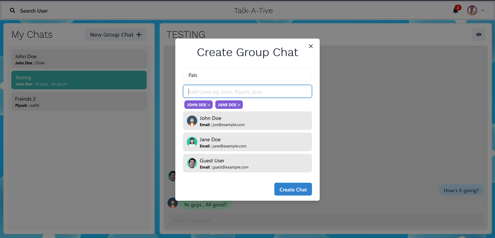

# Chit-Chat Hub

Chit-Chat Hub is a Full Stack Chatting App.
Uses Socket.io for real time communication and stores user details in encrypted format in Mongo DB Database.
## Tech Stack

**Client Side:** HTML, CSS, React JS

**Server:** Node JS, Express JS

**Database:** Mongo DB
  
Install dependencies

```bash
  npm install
```

```bash
  cd frontend/
  npm install
```

Start the server

```bash
  npm run start
```
Start the Client

```bash
  //open now terminal
  cd frontend
  npm start
```

  
# Features: 

### Authenticaton 


### Main Screen


### Real Time Chatting with Typing indicators


### Search Users


### Create Group Chats


### Notifications


## Made By

- [@ShivamKasera](https://github.com/kaseracodes)

  
# chat-app
